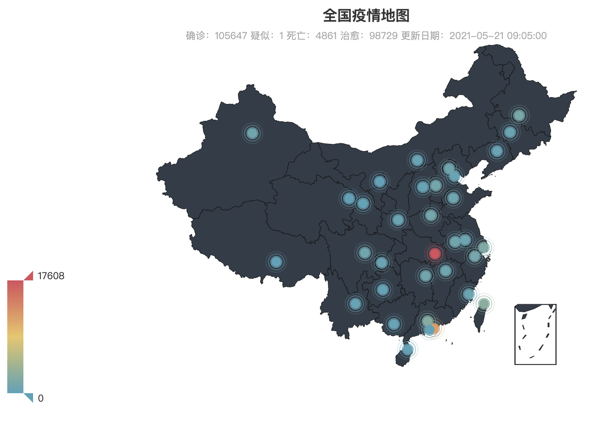
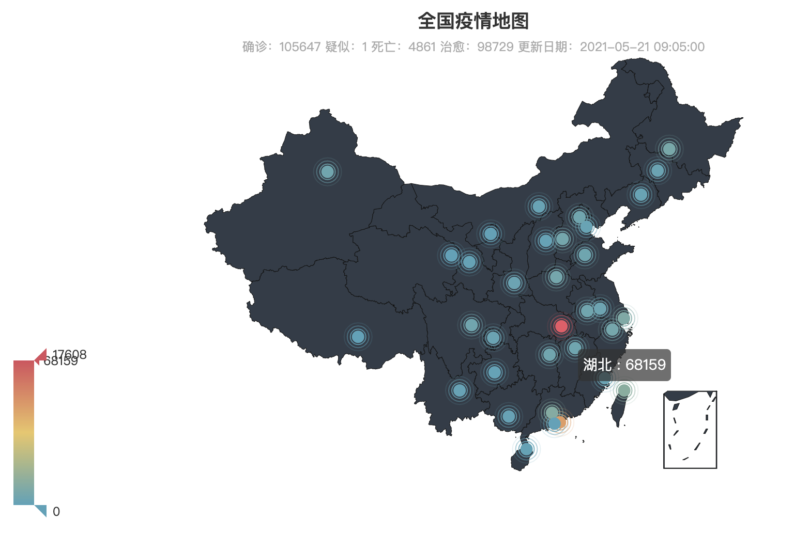

# 各省疫情统计并生成地图
## Environment
python 3.8.5

pyecharts 1.9.0
## Introduction
main.py: Get data from web source, and generate HTML. (从网源得到数据+生成html)
epidemic_provinces_map.html: Generated HTML.

## Start
```bash
pip install pyecharts
python main.py
```
## Result
Just using browser to open the epidemic_provinces_map.html


